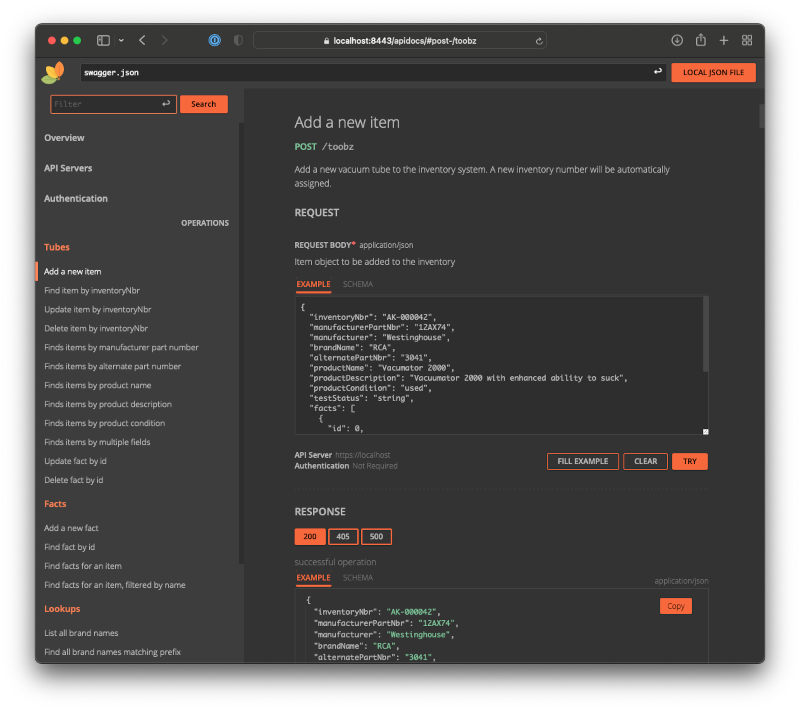

# toobz-api


Simple REST API for an inventory management system used to track loads of old vacuum tubes.

## Dependencies

* A running instance of PostgreSQL that can be accessed from the web service

## Configuration

The `toobz-api` application is configured via environment variables. The `start-dev.sh` script will
read a list of environment variables from a `.env-dev` file and then start a development web server. A
similar pattern is recommended for production.

### Port settings

The ports can be configured via `HTTP_PORT` and `HTTPS_PORT`. Defaults are 8000 and 8443, respectively.

### PostgreSQL settings

The PostgreSQL database needs to be accessible from the web service.
Its location is passed through the usual PostgreSQL environment variables.
For example,

```bash
PGHOST=localhost PGPORT=5432 PGDATABASE=toobz PGUSER=admin PGPASSWORD="" node dist/index.js
```

would attempt to start the server explicitly using the default values for all of the PostgreSQL environment
variables.

### SSL settings

In addition, if running under HTTPS (as you will likely need to - see discussion at `toobz-web`), you will
also need to pass `SSL_CERTFILE` and `SSL_KEYFILE` through the environemnt. Files should be in `.PEM`
format and are relative to the `sslcert` directory. Defaults are `servercert.pem` and `serverkey.pem` respectively.
See [SSL Certificates](sslcert/README.md) for further details.

## Installing

To install the application and its dependencies for development,

```bash
yarn install
```

## Database

On startup, the API server will expect the configured database to exist. It will connect and attempt to create
all necessary tables, sequences, and indexes if they do not yet exist. See `src/database.coffee` for details.

## API Reference

See the [Open API spec](src/apidocs/swagger.json) for full details.

Or, better yet, assuming that you are running service locally with the default port, simply view `https://localhost:8443/apidocs` in a browser for a much more pleasant experience ;)



You may also find that tools like [Swagger UI](https://swagger.io/tools/swagger-ui) or [Swagger Editor](https://swagger.io/tools/swagger-editor) prove useful.

## Development

The following runs the app under a local web server with hot-reload capabilitity convenient for development

```bash
# take care to also pass appropriate environment variables
nodemon src/index.coffee
```

The `start-dev.sh` script will take care of this for you, also reading the environment variables from a file named `.env-dev` which,
for obvious reasons, is included in `.gitignore` and is therefore not present in this repo. The `dotenv` file, however, is included
as an example that you can customize to your environment(s) and rename.

## Production

The following transpiles and minifies for production.

```bash
# using yarn
yarn build
# or, using the Makefile wrapper
make build
```

The results will be written to the `dist` folder and can be served by any static web server.
Take care to serve over HTTPS (see the limitations above otherwise).

## Security

Nope :)

Use an authenticating proxy if you're not on a private network or care about who else may be on such.

CORS headers are also added to responses (by the Express server, so your proxy, if using such, doesn't need to worry) so the API can be accessed from `toobz-web`. Tighten them down if you care about such things.

## Containers

A basic `Dockerfile` is provided for you to use if you like. Don't if you don't.

The basic sequence would be

```bash
make build
make image
cp dotenv .env-container # and edit as needed
./start-container.sh
```

## Technologies used

This project uses

* [CoffeeScript](https://coffeescript.org) because JavaScript is barely tolerable once you have had coffee
* [Express](https://expressjs.com) because it stays out of my way
* [RapiDoc](https://rapidocweb.com/index.html) because humans were not meant to read raw OpenAPI documentation
* [PostgreSQL](https://postgresql.org) because it is just generally awesome
* [Docker](https://docker.com) because containers are convenient, and Docker is, well, adequate

## License

MIT
